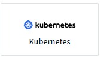

= Kubernetes에서 Agent 구성
:allow-uri-read: 

[role="lead"]
Cloud Insights는 을 사용합니다 link:https://docs.influxdata.com/telegraf/["텔레그라프"] 통합 데이터 수집을 위한 에이전트로 사용됩니다. Telegraf는 메트릭, 이벤트 및 로그를 수집 및 보고하는 데 사용할 수 있는 플러그인 기반 서버 에이전트입니다. 입력 플러그인은 시스템/OS에 직접 액세스하거나 타사 API를 호출하거나 구성된 스트림(예 Kafka, statsd 등). 출력 플러그인은 에이전트에서 Cloud Insights로 수집된 메트릭, 이벤트 및 로그를 전송하는 데 사용됩니다.

Cloud Insights의 최신 Telegraf 버전은 * 1.22.3 * 입니다.

NOTE: 정확한 감사 및 데이터 보고를 위해 * NTP(Network Time Protocol) * 또는 * SNTP(Simple Network Time Protocol) * 를 사용하여 Agent 시스템의 시간을 동기화하는 것이 좋습니다.

NOTE: Agent를 설치하기 전에 설치 파일을 확인하려면 정보 를 참조하십시오 <<Verifying Kubernetes Checksums>>.

toc::[]

== Agent 설치

에이전트를 설치하려면 먼저 다음을 수행해야 합니다.

. 에이전트에 사용할 호스트에 로그인합니다.
. Cloud Insights 사이트에 로그인하고 * 관리자 > 데이터 수집기 * 로 이동합니다.
. Data Collector * 를 클릭하고 설치할 데이터 수집기를 선택합니다.
. 호스트에 대한 Kubernetes 플랫폼을 선택합니다
. 나머지 단계를 따릅니다.

Windows, Linux 또는 Mac에 에이전트를 설치하려면 을 따릅니다 link:task_config_telegraf_agent.html["참조하십시오"].

NOTE: 호스트에 에이전트를 설치한 후에는 해당 호스트에 에이전트를 다시 설치할 필요가 없습니다.

TIP: 서버/VM에 에이전트를 설치한 경우 Cloud Insights는 사용자가 구성한 모든 데이터 수집기에서 취합할 뿐만 아니라 해당 시스템으로부터 메트릭을 수집합니다. 이러한 메트릭은 로 수집됩니다 link:task_config_telegraf_node.html[""노드" 메트릭"].

NOTE: 프록시를 사용하는 경우 Telegraf 에이전트를 설치하기 전에 해당 플랫폼의 프록시 지침을 읽으십시오.

== Kubernetes에 Agent 설치

Cloud Insights는 Kubernetes 컬렉션을 위한 * NetApp Kubernetes 모니터링 오퍼레이터 * 를 제공합니다. 데이터 수집기 추가 시 "Kubernetes" 타일을 선택하면 됩니다.

.전제 조건:
* NetApp Kubernetes 모니터링 오퍼레이터 설치는 Kubernetes 버전 1.19 이상에서 지원됩니다. Docker 컨테이너 런타임과 함께 사용할 경우 Cloud Insights는 NFS 및 iSCSI에 대한 POD-PV-스토리지 매핑을 표시할 수 있으며, 다른 런타임에서는 iSCSI만 표시합니다. 2022년 8월부터 NetApp Kubernetes Monitoring Operator는 Pod 보안 정책(PSP)을 지원합니다. 반드시 해야 합니다 <<upgrading-the-agent,업그레이드>> 해당 환경에서 PSP를 사용하는 경우 최신 NetApp Kubernetes 모니터링 사업자로 이동합니다.

* OpenShift 4.6-4.8에서 실행 중인 경우, 이러한 필수 구성 요소가 충족되도록 하기 위해 아래의 * OpenShift Instructions * 를 따라야 합니다.
* NetApp Kubernetes Monitoring Operator 및 해당 종속성(Telegraf, kubbe-state-metrics, fluentbit 등)은 Arm64 아키텍처를 실행하는 노드에서 지원되지 않습니다.
* _curl_, _sudo_, _openssl_, _sha256sum_ 및 _kubbctl_ 명령을 사용할 수 있어야 합니다. 최상의 결과를 얻으려면 이러한 명령을 경로에 추가하십시오.
* NetApp Kubernetes Monitoring Operator 설치를 통해 Kubbe-state-metrics가 자동으로 설치됩니다.
* 프록시를 사용하고 있는 경우 * Kubernetes * 용 프록시 지원 구성 섹션의 지침을 따르십시오.

* Kubernetes 클러스터 역할 및 역할 바인딩을 생성할 수 있는 권한이 있어야 합니다.

=== 모니터링은 Linux 노드에만 설치됩니다

Cloud Insights는 Linux를 실행하는 Kubernetes 노드 모니터링을 지원하며, 이들 플랫폼에서 다음 Kubernetes 레이블을 찾는 Kubernetes 노드 선택기를 지정합니다.

|===
| 플랫폼 | 라벨 

| Kubernetes V1.19 이상 | Kubernetes.IO/OS = Linux 

| Rancher + Cattle.IO를 오케스트레이션/Kubernetes 플랫폼으로 사용 | Cattle.io/OS = Linux 
|===

== NetApp Kubernetes 모니터링 오퍼레이터 설치

image:Kubernetes_Operator_Agent_Instructions.png["작업자 기반 설치"]

.Kubernetes에 NetApp Kubernetes Monitoring Operator Agent를 설치하는 단계:
. 클러스터 이름 및 네임스페이스를 입력합니다.
. 이러한 정보를 입력하면 Agent Installer 스니펫을 복사할 수 있습니다
. 이 분절을 클립보드에 복사하려면 버튼을 클릭합니다.
. 스니펫을 _bash_window에 붙여 넣고 실행합니다.
. 설치가 자동으로 진행됩니다. 완료되면 _COMPLETE Setup_ 단추를 클릭합니다.

=== OpenShift 지침

OpenShift 4.6-4.8에서 실행 중인 경우 "특별 권한 모드" 설정을 변경해야 합니다. 다음 명령을 실행하여 편집할 에이전트를 엽니다. "NetApp-monitoring" 이외의 네임스페이스를 사용하는 경우 명령줄에서 해당 네임스페이스를 지정합니다.

 kubectl edit agent agent-monitoring-netapp -n netapp-monitoring
파일에서 _privileged-mode:false_to_privileged-mode:true_를 변경합니다

=== NetApp Kubernetes 모니터링 Operator에 대한 프록시 지원 구성

모니터링 운영자에 대한 프록시를 구성하려면 다음 단계를 수행하십시오.

먼저, 편집할 _agent-monitoring-netapp_file을 엽니다.

 kubectl -n netapp-monitoring edit agent agent-monitoring-netapp
이 파일의 _spec:_ 섹션에서 다음 코드 블록을 추가합니다.

....
spec:
  proxy:
    isAuProxyEnabled: <true or false>
    isTelegrafProxyEnabled: <true or false>
    isFluentbitProxyEnabled: <true or false>
    password: <password for proxy, optional>
    port: <port for proxy>
    server: <server for proxy>
    username: <username for proxy, optional>
    noProxy: <comma separated list of IPs or resolvable hostnames that should bypass a proxy>
....

=== 사용자 지정/프라이빗 Docker 저장소 사용

사용자 지정 Docker 리포지토리를 사용하는 경우 다음을 수행합니다.

Docker 암호 확인:

 kubectl -n netapp-monitoring get secret docker -o yaml
위 명령의 출력에서 _.dockerconfigjson:_의 값을 복사/붙여 넣습니다.

Docker 암호 해독:

 echo <paste from _.dockerconfigjson:_  output above> | base64 -d
이 명령의 출력은 다음과 같은 json 형식으로 표시됩니다.

....
{ "auths":
  {"docker.<cluster>.cloudinsights.netapp.com" :
    {"username":"<tenant id>",
     "password":"<password which is the CI API key>",
     "auth"    :"<encoded username:password basic auth key. This is internal to docker>"}
  }
}
....
Docker 리포지토리에 로그인합니다.

....
docker login docker.<cluster>.cloudinsights.netapp.com (from step #2) -u <username from step #2>
password: <password from docker secret step above>
....
Cloud Insights에서 운영자 Docker 이미지를 가져옵니다.

 docker pull docker.<cluster>.cloudinsights.netapp.com/netapp-monitoring:<version>
다음 명령을 사용하여 <version> 필드를 찾습니다.

 kubectl -n netapp-monitoring get deployment monitoring-operator | grep "image:"
회사 정책에 따라 운영 Docker 이미지를 프라이빗/로컬/엔터프라이즈 Docker 저장소로 밀어 넣습니다.

모든 오픈 소스 종속성을 전용 Docker 레지스트리에 다운로드합니다. 공용 리포지토리와 동일한 디렉터리 구조를 사용합니다. 다음 오픈 소스 이미지를 다운로드해야 합니다.

....
docker.io/telegraf: 1.22.3
gcr.io/kubebuilder/kube-rbac-proxy: v0.11.0
k8s.gcr.io/kube-state-metrics/kube-state-metrics: v2.4.2
....
Fluent-bit가 활성화된 경우 다음 정보도 다운로드하십시오.

....
docker.io/fluent-bit:1.9.3
docker.io/kubernetes-event-exporter:0.10
....
새 Docker 저장소 위치를 반영하도록 에이전트 CR을 편집하고 자동 업그레이드를 비활성화합니다(활성화된 경우).

 kubectl -n netapp-monitoring edit agent agent-monitoring-netapp
 enableAutoUpgrade: false
....
docker-repo: <docker repo of the enterprise/corp docker repo>
dockerRepoSecret: <optional: name of the docker secret of enterprise/corp docker repo, this secret should be already created on the k8s cluster in the same namespace>
....
spec:_ 섹션에서 다음과 같이 변경합니다.

....
spec:
  telegraf:
    - name: ksm
      substitutions:
        - key: k8s.gcr.io
          value: <same as "docker-repo" field above>
....
모니터링 운영자 구축을 편집하여 새로운 Docker 저장소 위치를 반영하십시오.

 kubectl -n netapp-monitoring edit deploy monitoring-operator
다음 행을 교체하십시오...

 image: gcr.io/kubebuilder/kube-rbac-proxy:<kube-rbac-proxy-version>
다음으로...:

 image: <same as "docker-repo" field above>/kubebuilder/kube-rbac-proxy:<kube-rbac-proxy-version>

=== 스크립트 기반 K8s 모니터링에서 NetApp Kubernetes 모니터링 운영자로 업그레이드

이전에 설치된 스크립트 기반 Kubernetes 에이전트에서 NetApp Kubernetes 모니터링 사업자로 업그레이드하는 경우 다음 단계를 수행하십시오.

업그레이드 단계

. 스크립트 기반 모니터링 설치에서 ConfigMap 유지:
+
 kubectl --namespace ci-monitoring get cm -o yaml > /tmp/telegraf-configs.yaml
. K8s 운영자 기반 모니터링 솔루션을 설치할 때 사용할 K8s 클러스터 이름을 저장하여 데이터 연속성을 보장합니다.
+
CI에서 K8s 클러스터의 이름을 잊은 경우 다음 명령줄을 사용하여 저장된 구성에서 추출할 수 있습니다.

+
 cat /tmp/telegraf-configs.yaml | grep kubernetes_cluster | head -2
. 스크립트 기반 모니터링을 제거합니다
+
Kubernetes에서 스크립트 기반 에이전트를 제거하려면 다음을 수행합니다.

+
모니터링 네임스페이스를 Telegraf 전용으로 사용하는 경우:

+
 kubectl --namespace ci-monitoring delete ds,rs,cm,sa,clusterrole,clusterrolebinding -l app=ci-telegraf
+
 kubectl delete ns ci-monitoring
+
모니터링 네임스페이스를 Telegraf(전신) 외에 다른 용도로 사용하는 경우:

+
 kubectl --namespace ci-monitoring delete ds,rs,cm,sa,clusterrole,clusterrolebinding -l app=ci-telegraf

== NetApp Kubernetes Monitoring Operator를 중지하고 시작합니다

NetApp Kubernetes Monitoring Operator를 중지하려면 다음을 수행합니다.

 kubectl -n netapp-monitoring scale deploy monitoring-operator --replicas=0
NetApp Kubernetes Monitoring Operator를 시작하려면 다음을 수행합니다.

 kubectl -n netapp-monitoring scale deploy monitoring-operator --replicas=1

== Kubernetes에서 데이터를 수집하도록 Agent 구성

참고: NetApp Kubernetes Monitoring 운영자 기반 설치의 기본 네임스페이스는 _NetApp-모니터링_입니다. 네임스페이스와 관련된 명령에서 설치에 올바른 네임스페이스를 지정해야 합니다.

에이전트가 실행되는 POD는 다음 항목에 대한 액세스 권한이 있어야 합니다.

* 호스트 경로
* configMap을 클릭합니다
* 비밀

이러한 Kubernetes 객체는 Cloud Insights UI에 제공된 Kubernetes 에이전트 설치 명령의 일부로 자동으로 생성됩니다. OpenShift와 같은 일부 Kubernetes에서는 이러한 구성요소에 대한 액세스를 차단할 수 있는 강화된 보안 수준을 구현합니다. SecurityContextConstraint_는 Cloud Insights UI에 제공된 Kubernetes 에이전트 설치 명령의 일부로 생성되지 않으며 수동으로 만들어야 합니다. 생성된 후 Telegraf 포드를 다시 시작합니다.

[listing]
----
    apiVersion: v1
    kind: SecurityContextConstraints
    metadata:
      name: telegraf-hostaccess
      creationTimestamp:
      annotations:
        kubernetes.io/description: telegraf-hostaccess allows hostpath volume mounts for restricted SAs.
      labels:
        app: ci-telegraf
    priority: 10
    allowPrivilegedContainer: true
    defaultAddCapabilities: []
    requiredDropCapabilities: []
    allowedCapabilities: []
    allowedFlexVolumes: []
    allowHostDirVolumePlugin: true
    volumes:
    - hostPath
    - configMap
    - secret
    allowHostNetwork: false
    allowHostPorts: false
    allowHostPID: false
    allowHostIPC: false
    seLinuxContext:
      type: MustRunAs
    runAsUser:
      type: RunAsAny
    supplementalGroups:
      type: RunAsAny
    fsGroup:
      type: RunAsAny
    readOnlyRootFilesystem: false
    users:
    - system:serviceaccount:ci-monitoring:monitoring-operator
    groups: []
----

== Kube-state-metrics 정보

NetApp Kubernetes Monitoring Operator가 자동으로 Kudbe-state-metrics를 설치합니다. 사용자 개입이 필요하지 않으며 이 문서 섹션을 건너뛸 수 있습니다. 호기심에 대한 참조 정보를 제공하기 위해 여기에 포함되어 있습니다.

=== kubbe-state-metrics 서버 설치

NOTE: 운영자 기반 설치는 kubbe 상태 측정 지표 설치를 처리합니다. 운영자 기반 설치를 수행하는 경우 이 섹션을 건너뛰십시오.

kubbe-state-metrics 서버를 설치하려면 다음 단계를 따르십시오(스크립트 기반 설치를 수행하는 경우 필요).

.단계
. 임시 폴더(예: _/tmp/kuba-state-YAML-files/_)를 만들고 에서 .YAML 파일을 복사합니다 https://github.com/kubernetes/kube-state-metrics/tree/master/examples/standard[] 이 폴더로 이동합니다.
. kuby-state-metrics를 설치하는 데 필요한 .YAML 파일을 적용하려면 다음 명령을 실행합니다.
+
 kubectl apply -f /tmp/kube-state-yaml-files/

=== Kudbe-state-Metrics 카운터

kubbe 상태 메트릭 카운터에 대한 정보에 액세스하려면 다음 링크를 사용하십시오.

. https://github.com/kubernetes/kube-state-metrics/blob/master/docs/configmap-metrics.md["ConfigMap 메트릭입니다"]
. https://github.com/kubernetes/kube-state-metrics/blob/master/docs/daemonset-metrics.md["메트릭 분월 설정"]
. https://github.com/kubernetes/kube-state-metrics/blob/master/docs/deployment-metrics.md["구현 메트릭"]
. https://github.com/kubernetes/kube-state-metrics/blob/master/docs/ingress-metrics.md["수신 메트릭"]
. https://github.com/kubernetes/kube-state-metrics/blob/master/docs/namespace-metrics.md["네임스페이스 메트릭"]
. https://github.com/kubernetes/kube-state-metrics/blob/master/docs/node-metrics.md["노드 메트릭"]
. https://github.com/kubernetes/kube-state-metrics/blob/master/docs/persistentvolume-metrics.md["영구 볼륨 메트릭"]
. https://github.com/kubernetes/kube-state-metrics/blob/master/docs/persistentvolumeclaim-metrics.md["잔류 볼륨 클레임 메트릭"]
. https://github.com/kubernetes/kube-state-metrics/blob/master/docs/pod-metrics.md["POD 메트릭"]
. https://github.com/kubernetes/kube-state-metrics/blob/master/docs/replicaset-metrics.md["ReplicaSet 메트릭입니다"]
. https://github.com/kubernetes/kube-state-metrics/blob/master/docs/secret-metrics.md["비밀 지표"]
. https://github.com/kubernetes/kube-state-metrics/blob/master/docs/service-metrics.md["서비스 메트릭"]
. https://github.com/kubernetes/kube-state-metrics/blob/master/docs/statefulset-metrics.md["StatefulSet 메트릭입니다"]

== Agent를 제거합니다

이전에 설치된 스크립트 기반 Kubernetes 에이전트에서 을 실행 중인 경우, 반드시 다음을 수행해야 합니다 <<upgrading-the-agent,업그레이드>> NetApp Kubernetes 모니터링 사업자로 이동합니다.

=== 스크립트 기반 에이전트를 제거합니다

이러한 명령은 기본 네임스페이스 "CI-모니터링"을 사용합니다. 고유한 네임스페이스를 설정한 경우 이러한 네임스페이스 및 모든 후속 명령 및 파일로 대체합니다.

Kubernetes에서 스크립트 기반 에이전트를 제거하려면(예: NetApp Kubernetes Monitoring Operator로 업그레이드할 때) 다음을 수행합니다.

모니터링 네임스페이스를 Telegraf 전용으로 사용하는 경우:

 kubectl --namespace ci-monitoring delete ds,rs,cm,sa,clusterrole,clusterrolebinding -l app=ci-telegraf
 kubectl delete ns ci-monitoring
모니터링 네임스페이스를 Telegraf(전신) 외에 다른 용도로 사용하는 경우:

 kubectl --namespace ci-monitoring delete ds,rs,cm,sa,clusterrole,clusterrolebinding -l app=ci-telegraf

=== NetApp Kubernetes Monitoring Operator를 제거하려면

이러한 명령은 기본 네임스페이스 "NetApp-모니터링"을 사용합니다. 고유한 네임스페이스를 설정한 경우 이러한 네임스페이스 및 모든 후속 명령 및 파일로 대체합니다.

....
kubectl delete ns netapp-monitoring
kubectl delete clusterrole <name-space>-agent-manager-role <name-space>-agent-proxy-role
kubectl delete clusterrolebinding <name-space>-agent-manager-rolebinding <name-space>-agent-proxy-rolebinding
kubectl delete crd agents.monitoring.netapp.com
kubectl delete psp <name-space>-psp-nkmo
....
스크립트 기반 Telegraf 설치를 위해 보안 컨텍스트 제약 조건을 이전에 수동으로 만든 경우:

 kubectl delete scc telegraf-hostaccess

== Agent 업그레이드 중

NOTE: 이전에 스크립트 기반 에이전트를 설치한 경우 NetApp Kubernetes 모니터링 사업자로 업그레이드해야 합니다.

=== 스크립트 기반 에이전트에서 NetApp Kubernetes 모니터링 사업자로 업그레이드

이러한 명령은 기본 네임스페이스 "CI-모니터링"을 사용합니다. 고유한 네임스페이스를 설정한 경우 이러한 네임스페이스 및 모든 후속 명령 및 파일로 대체합니다.

Telegraf 에이전트를 업그레이드하려면 다음을 수행합니다.

* 클러스터 이름을 기록해 둡니다. 다음 중 하나를 실행하여 클러스터 이름을 볼 수 있습니다.

운영자:

 kubectl -n netapp-monitoring get agent -o jsonpath='{.items[0].spec.cluster-name}'
스크립트 기반:

 kubectl -n ci-monitoring get cm telegraf-conf -o jsonpath='{.data}' |grep "kubernetes_cluster ="
* 기존 구성 백업:
+
 kubectl --namespace ci-monitoring get cm -o yaml > /tmp/telegraf-configs.yaml

* <<uninstalling-the-agent,설치 제거>> 기존 상담원
* <<installing-the-agent,설치합니다>> 새 상담원].

=== NetApp Kubernetes Monitoring Operator 업그레이드

작업자 기반 설치의 경우 다음 명령을 실행합니다.

....
kubectl delete ns netapp-monitoring
kubectl delete crd agents.monitoring.netapp.com
kubectl delete clusterrole agent-manager-role agent-proxy-role agent-metrics-reader
kubectl delete clusterrolebinding agent-manager-rolebinding agent-proxy-rolebinding agent-cluster-admin-rolebinding
....

== Kubernetes 체크섬 확인 중

Cloud Insights 에이전트 설치 프로그램은 무결성 검사를 수행하지만 일부 사용자는 다운로드한 아티팩트를 설치하거나 적용하기 전에 자체 검증을 수행하려고 할 수 있습니다. 기본 다운로드 및 설치 대신 다운로드 전용 작업을 수행하기 위해 이러한 사용자는 UI에서 가져온 에이전트 설치 명령을 편집하고 뒤에 오는 "설치" 옵션을 제거할 수 있습니다.

다음 단계를 수행하십시오.

. 지시에 따라 Agent Installer 스니펫을 복사합니다.
. 코드 조각을 명령 창에 붙여 넣는 대신 텍스트 편집기에 붙여 넣습니다.
. 명령에서 뒤에 오는 "--install"(Linux/Mac) 또는 "-install"(Windows)을 제거합니다.
. 텍스트 편집기에서 전체 명령을 복사합니다.
. 이제 명령 창(작업 디렉토리)에 붙여넣고 실행합니다.

Windows 이외의 경우(이러한 예는 Kubernetes에 해당하고, 실제 스크립트 이름은 다를 수 있음):

* 다운로드 및 설치(기본값):
+
 installerName=cloudinsights-kubernetes.sh … && sudo -E -H ./$installerName --download –-install
* 다운로드 전용:
+
 installerName=cloudinsights-kubernetes.sh … && sudo -E -H ./$installerName --download

download-only 명령은 필요한 모든 아티팩트를 Cloud Insights에서 작업 디렉토리로 다운로드합니다. 아티팩트에는 다음이 포함되지만 이에 국한되지는 않습니다.

* 설치 스크립트
* 환경 파일입니다
* YAML 파일
* 서명된 체크섬 파일(SHA256.signed)
* 서명 확인을 위한 PEM 파일(NetApp_cert.pem

육안 검사를 통해 설치 스크립트, 환경 파일 및 YAML 파일을 확인할 수 있습니다.

PEM 파일의 지문이 다음과 같은 것인지 확인하여 PEM 파일을 확인할 수 있습니다.

 E5:FB:7B:68:C0:8B:1C:A9:02:70:85:84:C2:74:F8:EF:C7:BE:8A:BC
보다 구체적으로,

* 비 Windows:
+
 openssl x509 -fingerprint -sha1 -noout -inform pem -in netapp_cert.pem
* 창:
+
 Import-Certificate -Filepath .\netapp_cert.pem -CertStoreLocation Cert:\CurrentUser\Root

서명된 체크섬 파일은 PEM 파일을 사용하여 확인할 수 있습니다.

* 비 Windows:
+
 openssl smime -verify -in sha256.signed -CAfile netapp_cert.pem -purpose any
* Windows(위의 Import-Certificate를 통해 인증서 설치 후):
+
 Get-AuthenticodeSignature -FilePath .\sha256.ps1 $result = Get-AuthenticodeSignature -FilePath .\sha256.ps1 $signer = $result.SignerCertificate Add-Type -Assembly System.Security [Security.Cryptography.x509Certificates.X509Certificate2UI]::DisplayCertificate($signer)

모든 아티팩트가 만족스럽게 확인되면 다음을 실행하여 에이전트 설치를 시작할 수 있습니다.

비 Windows:

 sudo -E -H ./<installation_script_name> --install
창:

 .\cloudinsights-windows.ps1 -install

== Kubernetes Agent 설치 문제 해결

상담원 설정에 문제가 있는 경우 다음과 같은 방법을 시도해 보십시오.

[cols="2*"]
|===
| 문제: | 다음을 시도해 보십시오. 

| _etcd_가 Kubernetes 클러스터 데이터 저장소가 아닌 클러스터의 경우 Telegraf RS POD에 다음과 같은 메시지가 표시됩니다. [inputs.prometheus] 플러그인 오류: 키 쌍을 로드할 수 없습니다. /etc/Kubernetes/pn/pki/etcd/server.crt: /etc/Kubernetes/pki/etcd/server.key: open/etc/cKubernetes/etcd/server/crt/server.crt 파일 또는 crt 파일 디렉터리 | Cloud Insights는 _etcd_를 K8s 데이터 저장소로 모니터링하는 기능만 지원합니다. 다음 지침에 따라 구성을 변경하여 etcd 데이터를 수집하지 않도록 에이전트를 수정할 수 있습니다. kubctl -n NetApp 모니터링 에이전트 모니터링 편집 에이전트 모니터링 - NetApp 해당 파일에서 다음 섹션을 삭제합니다. -name:Prometheus_etcd run-mode: - ReplicaSet 

| Cloud Insights를 사용하여 이미 에이전트를 설치했습니다 | 호스트/VM에 이미 에이전트를 설치한 경우 에이전트를 다시 설치할 필요가 없습니다. 이 경우 Agent 설치 화면에서 해당 플랫폼 및 키를 선택하고 * 계속 * 또는 * 마침 * 을 클릭합니다. 

| 이미 에이전트가 설치되었지만 Cloud Insights 설치 프로그램을 사용하지 않습니다 | 올바른 기본 구성 파일 설정을 위해 이전 에이전트를 제거하고 Cloud Insights 에이전트 설치를 실행합니다. 완료되면 * 계속 * 또는 * 마침 * 을 클릭합니다. 

| Kubernetes 영구 볼륨과 해당 백엔드 스토리지 장치 간의 하이퍼링크/연결이 표시되지 않습니다. 내 Kubernetes 영구 볼륨은 스토리지 서버의 호스트 이름을 사용하여 구성됩니다. | 기존 Telegraf 에이전트를 제거한 다음 최신 Telegraf 에이전트를 다시 설치하는 단계를 따릅니다. Telegraf 버전 2.0 이상을 사용해야 합니다. 

| E0901 15:21:39.962145 1 리플렉터.go:178]k8s.io/kbe-state-metrics/internal/store/builder.go:352: * v1.목록에 실패했습니다. MutatingWebhookConfiguration: 서버에서 요청된 리소스 E0901 15:21:43.168352.kIs.tu2o.tu2352: revm.u2352.u2352.u2o.testimeu2352.u2n.u2352.u2o.u2o.u2352.testime-ve-v | 이러한 메시지는 Kubernetes 버전 1.17 이하에서 kube-state-metrics 버전 2.0.0 이상을 실행하는 경우 발생할 수 있습니다. 쿠버네티스 버전을 얻으려면: _kubbctl version_kubbe-state-metrics 버전:_kubbectl deploy/kube-state-metrics-o jsonpath='{..image}'_이러한 메시지가 발생하지 않도록 사용자는 kube-state-metrics 구축을 수정하여 다음 Lallase를 비활성화할 수 있습니다._muthookconfigurations_webhookconfigurettal_configuretedconfig_webvalidateCLI_webvalidateusetausetausetauseusetausetauseuse 리소스 = certificationesigningrequests, configmap, crontobs, demonset, 배포, 끝점, 수평 포드자동크기, 링스, 작업, reflodritranges, namespaces, networkpolicies, nistentvolumes, persistentpersistent volumes, podin예산, replicatingfasts, repliceters, replicatingreallets, replicets, replicets, repliceties, replicenets, replicatingreenets, replicets, replicenets, replicets, service.networksets, service.sets, service.sets, vistenets, visteneties, replicaturies.networksets, service.sets, reseties.networksets, replicaturies, inations, replicaticaturies, replicaturies, replicaturies, inations validingwebhookconfigurations, volumeAttachments" 

| Kubernetes에 Telegraf를 설치 또는 업그레이드했지만 Telegraf Pod가 시작되지 않았습니다. Telegraf ReplicaSet 또는 DemonSet에서 다음과 같은 오류를 보고합니다. 오류 생성: POD "Telegraf-RS -"가 금지되었습니다. 보안 컨텍스트 제약 조건을 기준으로 유효성을 검사할 수 없습니다. [SPEC.volumes [2]: 잘못된 값: "hostPath": hostPath 볼륨을 사용할 수 없습니다.] | 보안 컨텍스트 제약 조건(위의 Kubernetes에서 데이터를 수집하도록 에이전트 구성 섹션 참조)이 없는 경우 이를 생성합니다. Security Context Constraint 에 지정된 네임스페이스 및 서비스 계정이 Telegraf ReplicaSet 및 DemonSet의 네임스페이스 및 서비스 계정과 일치하는지 확인합니다. KUBeck은 SCC Telegraf-hostaccess | grep ServiceAccount kubtl -n CI-monitoring -- RS Telegraf-RS | grep-i "Namespace:"kubbeck-n CI-monitoring RS Telegraf-RS | grep-i "Service Account:"를 설명합니다. dS Telegraf-dS -dS -dl -dS -dl -dS -dl -dl -dS -dl -dl -dl -dl -dl 

| Telegraf의 오류 메시지는 다음과 유사하지만 Telegraf가 시작되고 실행됩니다. Oct 11 14:23:41 IP-172-31-39-47 시스템[1]: 플러그인 기반 서버 에이전트를 시작하여 메트릭을 영향력 있는 xDB에 보고합니다. 10월 11일 14:23:41 IP-172-31-39-47 Telegraf[1827]: time="2021-10-11T14:23:41Z" level=error msg="캐시 디렉토리를 만들지 못했습니다. /etc/Telegraf/.cache/눈송이, 오류: mkdir /etc/Telegraf/.ca che: 사용 권한이 거부되었습니다. ignored\n" func="gosnowflake.(* defaultLogger).Errorf" file="log.go:120" Oct 11 14:23:41 IP-172-31-39-47 Telegraf[1827]: time="2021-10-11T14:23:41Z" level=error msg="를 열지 못했습니다. 무시되었습니다. 열기 /etc/telgraf/.cache/눈송이/OCSP_response_cache.json: 해당 파일 또는 디렉토리가 없습니다. \n" func="nowhosflake.(* defaultLogger).Errorf" 파일="log.go:120" Oct 11 14:23:41 IP-172-31-39-47 Telegraf[1827] 1131-41123:1121-41123: 텔레그라프 1.19.3 시작 | 이는 알려진 문제입니다. 을 참조하십시오 link:https://github.com/influxdata/telegraf/issues/9407["이 GitHub 기사를 참조하십시오"] 를 참조하십시오. Telegraf가 실행 중인 경우 사용자는 이러한 오류 메시지를 무시할 수 있습니다. 

| Kubernetes에서 Telegraf 포드가 "mountstats 정보 처리 중 오류: mountstats 파일을 열지 못했습니다. /hostfs/proc/1/mountstats, 오류: open/hostfs/proc/1/mountstats: 사용 권한이 거부되었습니다." 오류를 보고합니다. | SELinux가 설정되어 있고 강제 적용되는 경우 Telegraf 포드가 Kubernetes 노드의 /proc/1/mountstats 파일에 액세스하지 못할 수 있습니다. 이 제한 사항을 완화하려면 다음 중 하나를 수행합니다. • 에이전트 편집('kubtl edit agent-monitoring-NetApp')을 하고 "privileged-mode:false"를 "privileged-mode:true"로 변경합니다. 

| Kubernetes에서 Telegraf ReplicaSet Pod가 다음 오류를 보고합니다: inputs.prometheus] [플러그인 오류: keypair /etc/Kubernetes/PKI/etcd/server.crt: /etc/Kubernetes/PKI/etcd/server.key: open /etc/cubs/pi/etcd/server.crt: 해당 파일 또는 디렉토리가 없습니다 | Telegraf ReplicaSet POD는 마스터나 etcd로 지정된 노드에서 실행되도록 설계되었습니다. ReplicaSet 포드가 이러한 노드 중 하나에서 실행되고 있지 않으면 이러한 오류가 발생합니다. 마스터/etcd 노드에 문제가 있는지 확인합니다. 만약 그렇다면, 텔레그라프 ReplicaSet, 텔레그라프-RS에 필요한 내약성을 추가한다. 예를 들어 ReplicaSet...kubtl을 편집하여 RS Telegraf-RS...를 편집하고 사양에 적절한 내약성을 추가합니다. 그런 다음 ReplicaSet 포드를 다시 시작합니다. 

| PSP 환경이 있습니다. 이 문제가 모니터링 오퍼레이터에게 영향을 미칩니까? | PSP(Pod 보안 정책)를 사용하여 Kubernetes 클러스터를 실행 중인 경우 최신 NetApp Kubernetes 모니터링 사업자로 업그레이드해야 합니다. PSP를 지원하는 현재 NKMO로 업그레이드하려면 다음 단계를 따르십시오. 1. 이전 모니터링 운영자 제거: kubtl delete agent-monitoring -netapp-n netapp-monitoring kubtl delete ns NetApp-monitoring kubctl delete CRD agents.monitoring.netapp.com kubeck delete clusterrole agent-manager-role agent-proxy-role agent-role role agent-rolebinding agent-cluster-admin-rolebinding 2. 최신 버전의 모니터링 연산자를 배포합니다. 

| NKMO를 배포하는 데 문제가 발생했고 PSP를 사용하고 있습니다. | 1.kubctl -n <name-space> 에이전트 편집 명령을 사용하여 에이전트를 편집합니다. 2. '보안 - 정책 - 사용'을 '거짓'으로 표시합니다. 그러면 Pos 보안 정책이 비활성화되고 NKMO가 배포될 수 있습니다. 다음 명령을 사용하여 확인합니다. kubbtl get psp (Pod 보안 정책이 제거되었음을 표시해야 함) kubctl all -n <name-space> 

| NetApp Kubernetes Monitoring Operator를 설치한 직후 로그에 다음 내용이 표시됩니다. [inputs.prometheus] 플러그인 오류: HTTP 요청을 \http://kube-state-metrics.<namespace>.svc.cluster.local:8080/metrics: get\http://kube-state-metrics.<namespace>.svc.cluster.local:8080/metrics: 다이얼 TCP: lookup kuby-state-metrics. <namespace>.svc.cluster.local: 해당 호스트가 없습니다 | 이 메시지는 일반적으로 새 오퍼레이터가 설치되어 있고 _Telegraf-RS_POD가 _KSM_POD가 가동되기 전에 작동 중일 때만 표시됩니다. 이러한 메시지는 모든 Pod가 실행되면 중지되어야 합니다. 

| 명령을 실행하여 CI 에이전트를 설치하여 Kubernetes 정보를 수집했지만, UI에 내 Kubernetes 정보가 표시되지 않습니다. | 다음 명령을 실행하고 출력을 수집한 다음 NetApp 지원 팀에 문의하십시오. 이러한 명령은 기본 네임스페이스를 사용합니다. 고유한 네임스페이스를 설정한 경우 이러한 명령과 모든 후속 명령에서 해당 네임스페이스를 대체합니다. kubbctl -n NetApp - 모니터링 배포, 에이전트, RS, DS, POD kudtl -n NetApp 모니터링 설명 deploy kubtl -n NetApp - 모니터링 로그 <monitoring-operator pod> -c manager kubbctl -n NetApp - 모니터링 로그 <Telegraf-ds> kebtl -n NetApp - 모니터링 로그 <Telegraf -RS pod> kubbeck -veck -veck -be-log 
|===
추가 정보는 에서 찾을 수 있습니다 link:concept_requesting_support.html["지원"] 페이지 또는 에 있습니다 link:https://docs.netapp.com/us-en/cloudinsights/CloudInsightsDataCollectorSupportMatrix.pdf["Data Collector 지원 매트릭스"].
